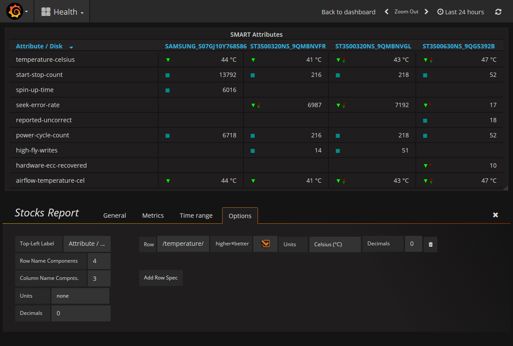
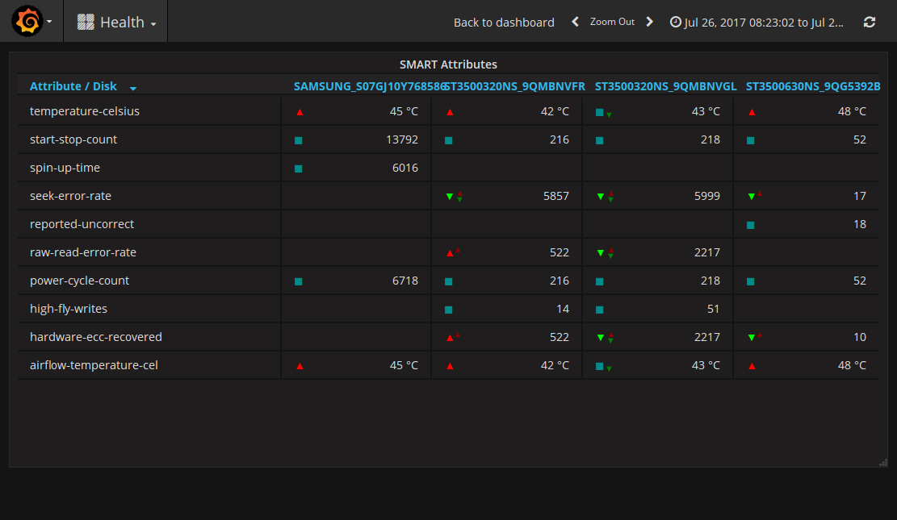
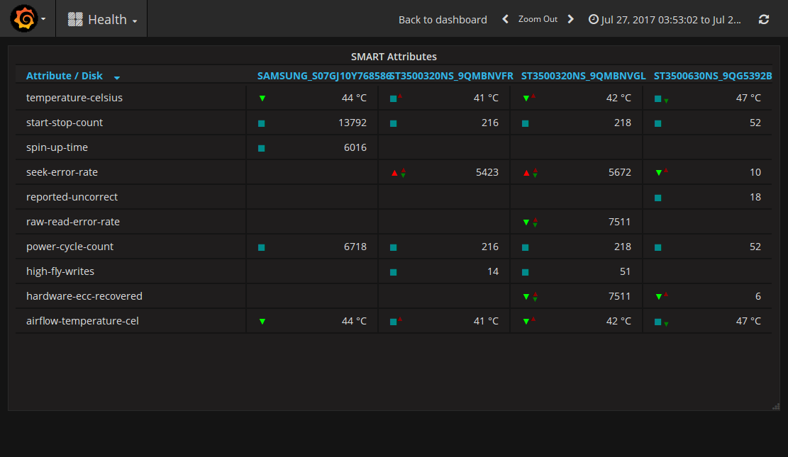

# Grafana Stocks Report

A stocks report panel for [Grafana](http://grafana.org/).

This plugin forked from [btplc-peak-report-panel](BTplc/grafana-peak-report).

## Compatibility

This panel should work with the following data sources: [Graphite](https://grafana.net/plugins/graphite)

## Development

[Docker](https://www.docker.com/) is an easy way to spin-up an instance of Grafana. With docker installed, run the following command in the directory containing the plugin; this will expose the local plugin on your machine to the Grafana container so you can test it out.

    docker run -it -v $PWD:/var/lib/grafana/plugins/peak_report -p 3000:3000 --name grafana.docker grafana/grafana

Now do this...

    # Install development packages
    npm install

    # Install the grunt-cli
    sudo npm install -g grunt-cli

    # Compile into dist/
    grunt

    # Restart Grafana to see it
    docker restart grafana.docker

    # Watch for changes (requires refresh)
    grunt watch

Use `grunt test` to run the Jasmine tests for the plugin; and `grunt eslint` to check for style issues. Note that the plugin controller isn't tested because it depends on Grafana native libraries, which aren't available outside of Grafana.

## Contributing

For bugs and new features, open an issue and we'll take a look. If you want to contribute to the plugin, you're welcome to submit a pull request - just make sure `grunt` runs without errors first.
